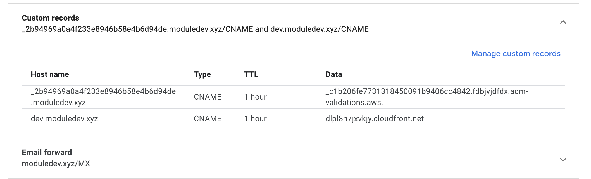

1. Create a cert for dev.moduledev.xyz in aws. May have to setup email forwarding in google domains if you opt for email validation of the cert.
2. Create commit and push, let pipeline finish in circleci
3. setup CNAME in google domains like the following to forward to cloudfront. The other CNAME is to do cert validation using DNS
   
